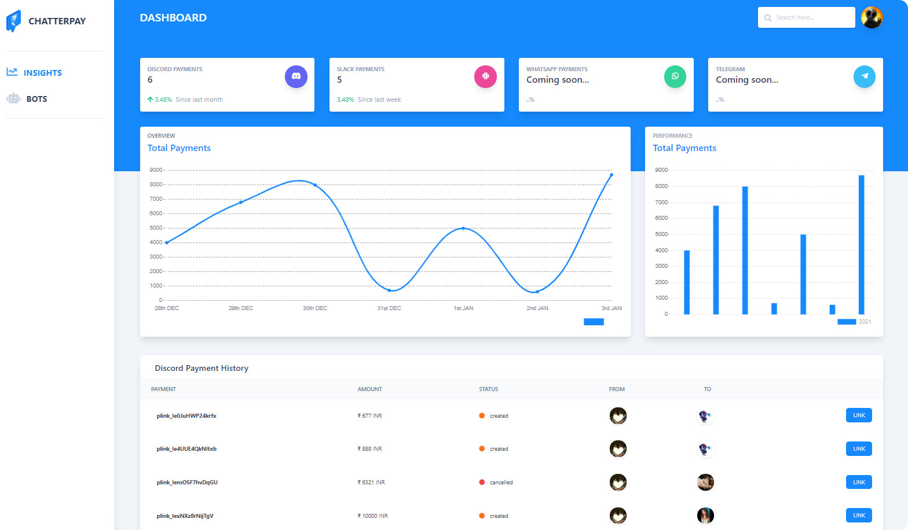

<p align="center">
   <br/>
   <a href="https://chatterpay-discord-bot.vercel.app/" target="_blank"></a>
   <h3 align="center">Chatterpay</h3>
   <p align="center">Next generation payment bot!</p>
</p>

<div align="center">


</div>


# Chatterpay

A simple bot that automates the process of p2p payments using Razorpay APIs. Chatterpay is the only bot you need to automate your payments in your Discord / Slack community.

 ## Checkout our website to learn more!
[chatterpay-discord-bot.vercel.app](https://chatterpay-discord-bot.vercel.app/)
</hr>


## Workflow of the Discord bot


## Workflow of the Slack bot


## Chatterpay Dashboard


## Getting started

First, make sure you have all these installed on your local machine & then continue.

* Node.js v16.13.1^
* NPM v8.1.0^

### Installation

```bash
# Clone the repository
git clone https://github.com/anomic30/Chatterpay-discord-bot.git
# Enter into the directory
cd chatterpay-discord-bot/
# Enter into dashboard
cd Dashboard
npm install
# Enter into Discord bot
cd DiscordBot
npm install
# Enter into Slack bot
cd SlackBot
npm install
# Enter into Chatterpay Database
cd Chatterpay DB
npm install
```
### ⚠️ Important!
In order to use this for your own purpose, check the .env.example in each of the directories.

### Starting the application

```bash
# To start the dashboard in development mode
npm run dev
# To start the discord bot in development mode
npm run dev
# To start the slack bot in development mode
npm run dev
# To start the chatterpay server in development mode
npm run dev
```

## Bot Features & Commands

* 💸 Pay a Discord user / Slack user

`/pay user_name amount`

<br />


